# Diseño de Software - TaskManager

## 1. Informacion general

- **Proyecto:** TaskManager Frontend
- **Fecha:** 2026-06-10
- **Version del documento:** 0.1
- **Alcance:** frontend Angular de `TaskManager` integrado con el backend de microservicios con spring

Este documento resume la arquitectura del frontend, su relacion con el backend, los principales flujos de uso, y una primera coleccion de diagramas UML y mockups textuales de pantalla.

## 2. Objetivo del sistema

Este sistema frontend es la capa de presentacion de la plataforma TaskManager. Su proposito es permitir a los usuarios:

- registrarse e iniciar sesion
- consultar y administrar proyectos
- consultar y administrar tareas en un tablero kanban
- revisar el equipo de trabajo y comunicarse con otros colaboradores
- consultar informacion institucional y legal del producto

La interfaz esta pensada para trabajar con el backend de microservicios ya existente:

- `api-gateway` como punto de entrada unico
- `auth-service` para autenticacion, usuarios y sesion
- `project-service` para proyectos
- `task-service` para tareas
- `service-registry` y `config-server` como soporte de infraestructura

## 3. Alcance funcional del frontend

### 3.1 Pantallas publicas

- Landing page
- Login
- Register
- About
- Privacy
- Terms
- Not Found

### 3.2 Pantallas autenticadas

- Home / Dashboard de proyectos
- Project workspace
- Kanban workspace
- Team workspace

### 3.3 Componentes transversales

- Top navigation bar
- Side drawer responsive
- Footer
- Toast notifications
- Loading screen
- Modales y paneles laterales para crear, editar y eliminar entidades

## 4. Stack tecnico

### 4.1 Frontend

- Angular 21
- Angular Router con `view transitions`
- Angular signals y forms signals
- Angular guards para portecion de rutas
- HttpClient con interceptor global
- Tailwind CSS 4
- Flowbite
- RxJS
- Vitest para pruebas

### 4.2 Integracion con backend

Todos los consumos de datos salen desde `environment.authApiBaseUrl` hacia el `api-gateway`.

- Desarrollo: `http://192.168.100.249:8080`
- Produccion: `https://taskmanagerbackend.duckdns.org`

El frontend usa `withCredentials: true` para enviar y recibir la cookie `AUTH_TOKEN`.

## 5. Arquitectura de frontend

### 5.1 Capas detectadas

1. **Presentacion**
   - Pages
   - Components
   - Shared UI

2. **Dominio de UI**
   - Services de estado con `signal`
   - Validaciones de formularios
   - Helpers de presentacion

3. **Infraestructura HTTP**
   - `AuthService`, `UserService`, `ProjectService`, `TaskService`
   - `HttpInterceptor` global para `withCredentials`

4. **Enrutamiento y seguridad**
   - `authGuard`
   - `guestGuard`
   - `authInterceptor`

### 5.2 Flujo de arranque

1. `main.ts` arranca `App` con `appConfig`.
2. `app.config.ts` registra router, HTTP client e interceptor.
3. `App` decide si muestra loader, router outlet o toast.
4. Las paginas autenticas usan `authGuard`.
5. El login y la restauracion de sesion se hacen con cookie JWT.

## 6. Mapa de pantallas

| Area | Pantalla | Proposito |
|---|---|---|
| Publica | Landing | Presentacion del producto y CTA principal |
| Publica | Login | Autenticacion de usuario |
| Publica | Register | Alta de usuario |
| Publica | About / Privacy / Terms | Informacion institucional y legal |
| Publica | Not Found | Ruta invalida |
| Privada | Home / Projects | Resumen y administracion de proyectos |
| Privada | Kanban | Gestion operativa de tareas |
| Privada | Team | Roster y comunicacion |

## 7. Integracion frontend-backend

### 7.1 Endpoints mas usados desde el frontend

| Pantalla / componente | Endpoint principal | Uso |
|---|---|---|
| Login | `POST /api/v1/auth/login` | Iniciar sesion |
| Login | `POST /api/v1/auth/session` | Recuperar usuario autenticado |
| Login | `POST /api/v1/auth/refresh` | Renovar cookie JWT |
| Register | `POST /api/v1/user/register` | Crear usuario |
| Register | `POST /api/v1/user/exist` | Validar email duplicado |
| Home / Projects | `GET /api/v1/project/ofTheUser/{id}` | Cargar proyectos del usuario |
| Home / Projects | `POST /api/v1/user/search/team` | Resolver miembros del equipo |
| Home / Projects | `POST /api/v1/task/byprojects` | Cargar tareas por proyecto |
| Project form | `POST /api/v1/project/` | Crear proyecto |
| Project details | `GET /api/v1/project/{id}` | Leer proyecto |
| Project details | `PUT /api/v1/project/{id}` | Editar proyecto |
| Project details | `DELETE /api/v1/project/{id}` | Eliminar proyecto |
| Kanban | `POST /api/v1/task/` | Crear tarea |
| Kanban | `PUT /api/v1/task/{id}/status/{status}` | Cambiar estado |
| Kanban | `PUT /api/v1/task/{id}/blocked/{blocked}` | Bloquear o desbloquear |
| Kanban | `PUT /api/v1/task/{id}` | Editar tarea |
| Kanban | `DELETE /api/v1/task/set` | Eliminar tarea y subtareas |

## 8. Sistema visual

### 8.1 Direccion de diseño

La interfaz usa una estetica oscura con gradientes azules y fondos con blur. Se percibe como una consola de trabajo mas que como una web corporativa clasica.

### 8.2 Recursos visuales

- Logo e iconos propios en `public/`
- Imgenes hero para la landing
- Avatares y placeholders de usuario
- Componentes Flowbite para menus, dropdowns y modales

### 8.3 Tokens y estilos globales

En `src/styles.css` se definieron clases base para homogeneizar la UI:

- `.my-button`
- `.my-button-cancel`
- `.my-button-danger`
- `.my-input`
- `.my-input-checkbox`

Tambien se usa una paleta primaria azul y transiciones de vista para navegar entre rutas.

### 8.4 Comportamiento responsive

- En desktop, el sidebar se mantiene fijo.
- En mobile, el sidebar se abre como drawer con overlay.
- Los paneles de creacion y detalle se abren desde la derecha y ocupan todo el alto.
- Los formularios usan disposicion de una o dos columnas segun ancho de pantalla.

## 9. UML - Diagrama de clases

El siguiente diagrama resume los componentes, servicios e interfaces mas importantes del frontend. Se omitieron algunas clases secundarias para mantenerlo legible.

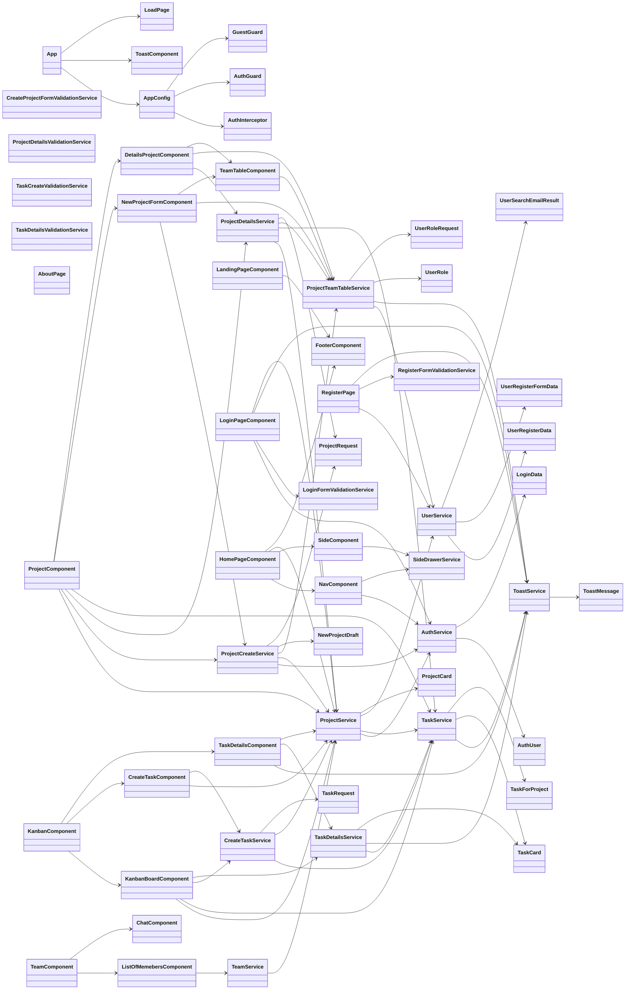

## 10. UML - Diagramas de secuencia

### 10.1 Login y restauracion de sesion

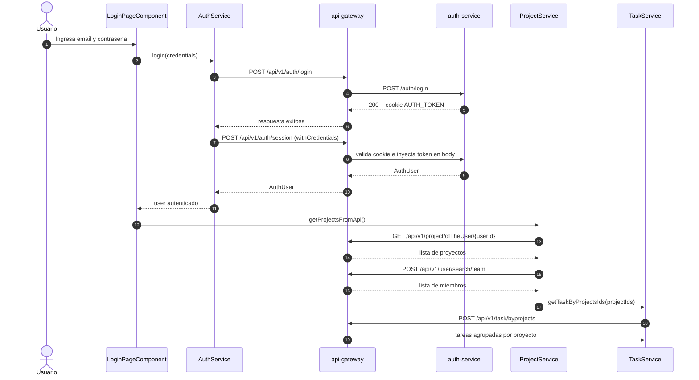

### 10.2 Carga del dashboard principal

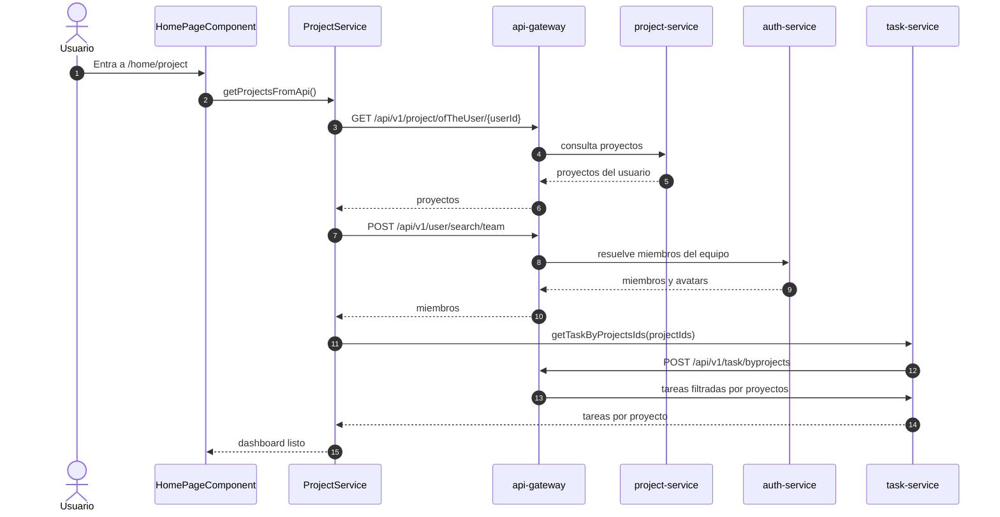

### 10.3 Creacion y actualizacion de una tarea

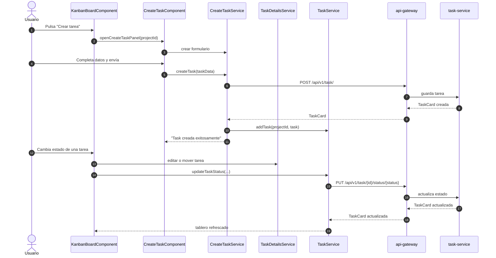

## 11. UML - Diagramas de estado

### 11.1 Estado de una tarea

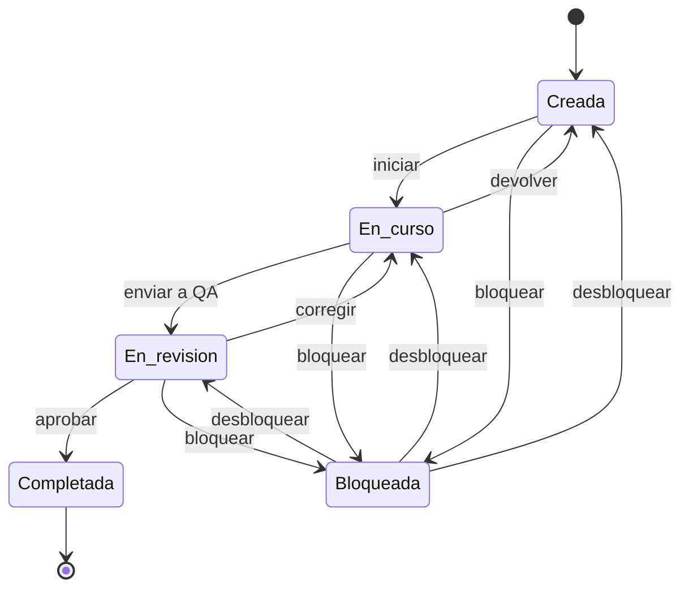

Interpretacion:

- la tarea nace en `Creada`
- el flujo principal avanza por `En curso`, `En revision` y `Completada`
- la tarea puede bloquearse desde `Creada`, `En curso` o `En revision`
- al desbloquearse, vuelve al mismo estado que tenia antes de bloquearse
- mientras esta en `Bloqueada`, no puede avanzar a un estado distinto del previo

### 11.2 Estado de sesion autenticada

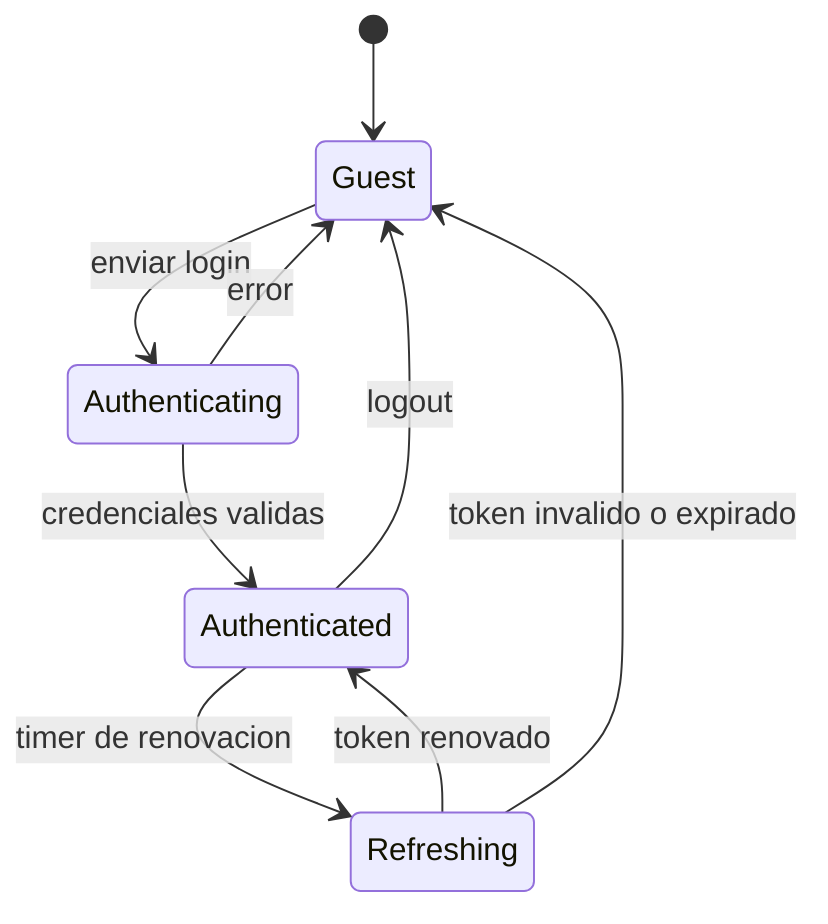

Interpretacion:

- `Guest` representa un usuario sin sesion valida
- `Authenticated` representa un usuario con cookie `AUTH_TOKEN` valida
- `Refreshing` modela el refresco automatico que se ejecuta desde `AuthService`

## 12. Mockups de pantallas

Los siguientes mockups son wireframes conceptuales en los que se baso el frontend del sistema.

### 12.1 Landing page

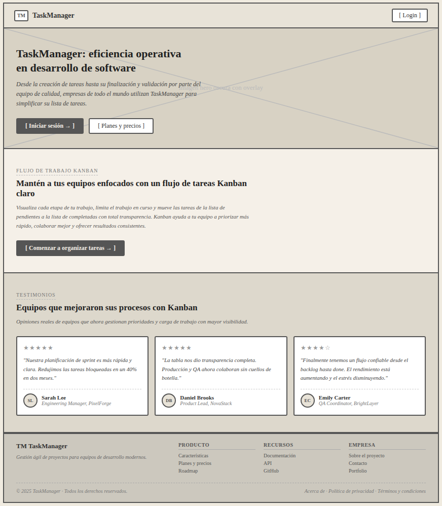

### 12.2 Login

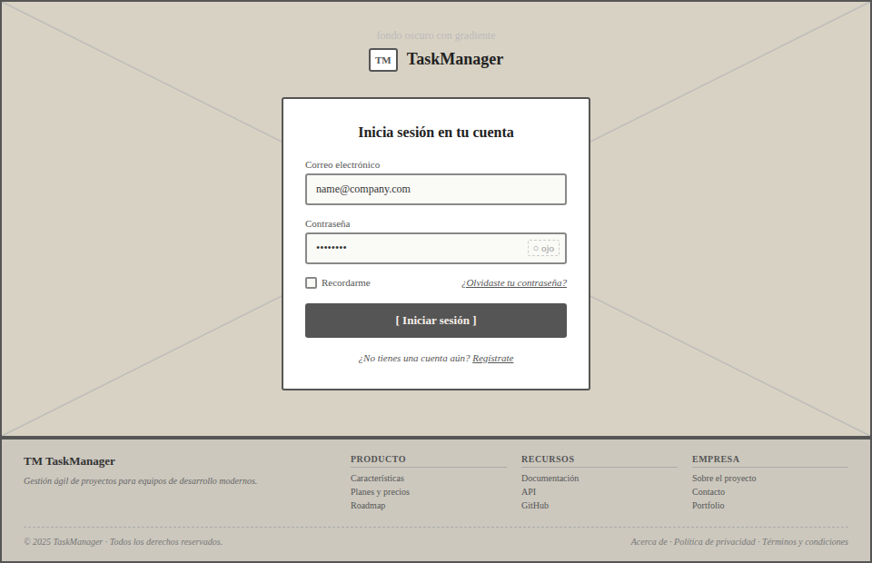

### 12.3 Register

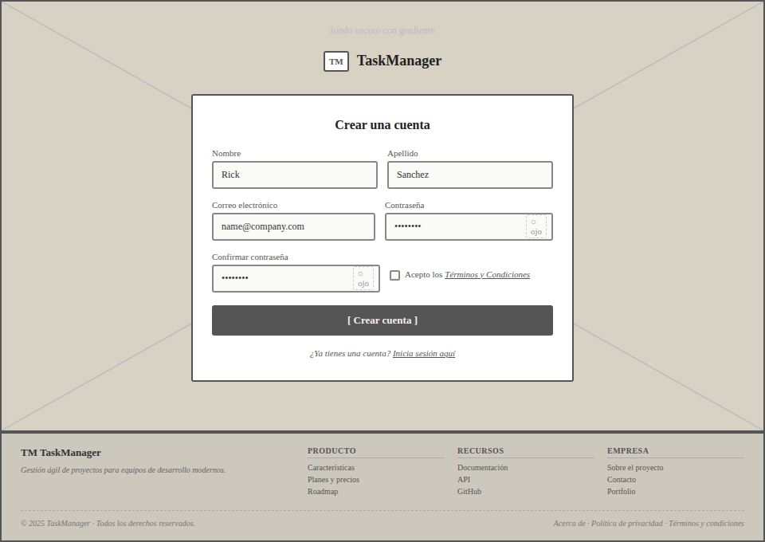

### 12.5 Projects

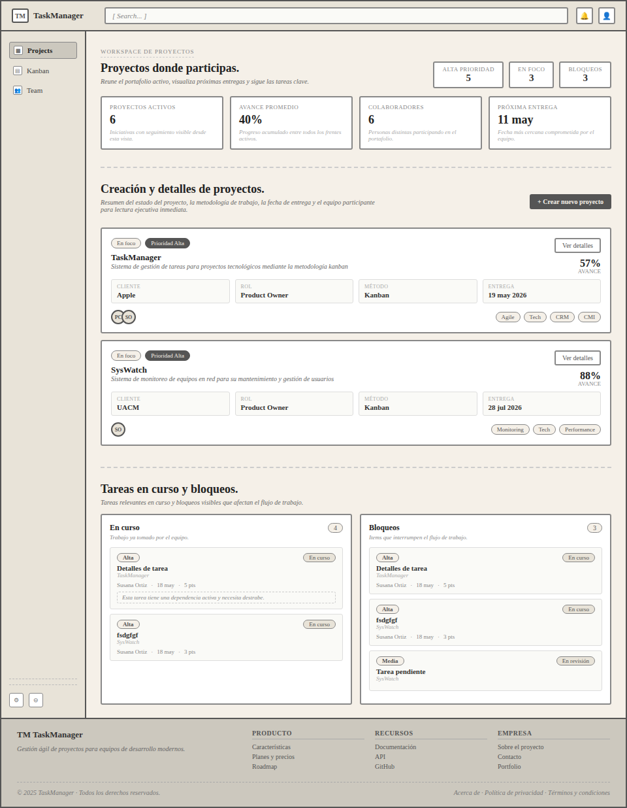

### 12.6 Panel lateral create project

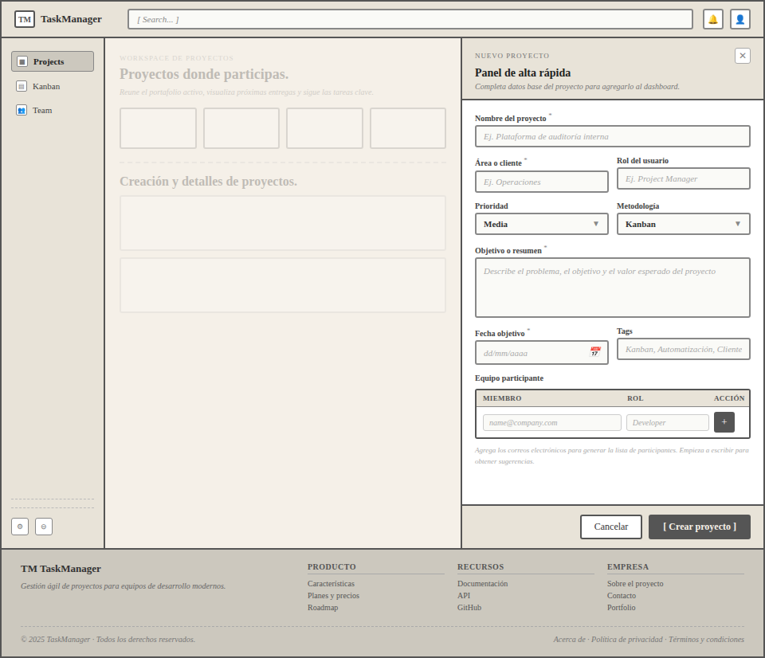

### 12.7 Kanban

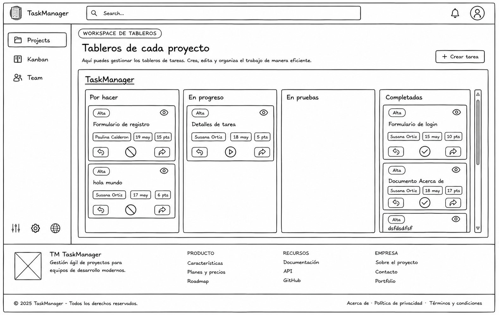

### 12.8 Panel lateral create task

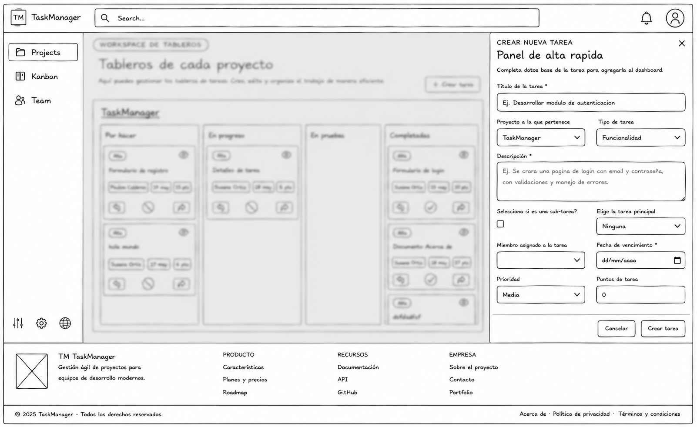

### 12.9 Team workspace

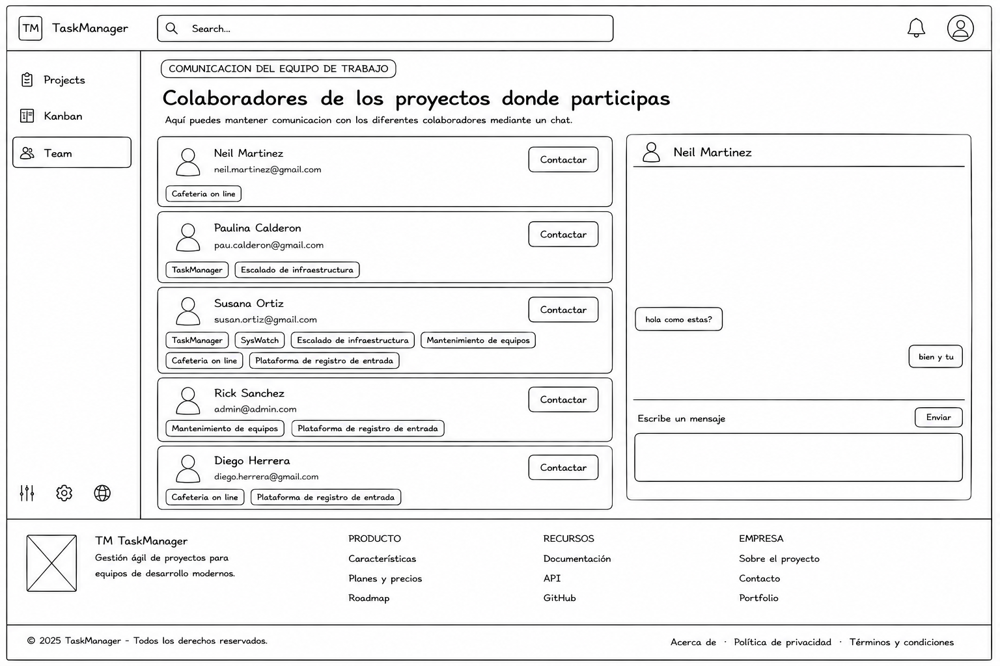

## 13. Reglas de diseño

### 13.1 Consistencia UI

- Los formularios comparten la misma familia de controles.
- Las acciones primarias usan botones azules.
- Las acciones destructivas usan botones rojos.
- El estado vacio y los loaders estan resueltos visualmente.

### 13.2 Interaccion

- Las secciones autenticadas muestran datos en tiempo real desde signals.
- Los paneles laterales evitan cambiar de pagina para crear o editar.
- Los toasts confirman exito o error sin romper el flujo.
- El refresh de sesion se ejecuta automaticamente para no interrumpir el trabajo.

### 13.3 Responsive y accesibilidad

- El sidebar se adapta a mobile con overlay.
- Los modales usan `aria-modal` y `role="dialog"`.
- Los inputs incluyen labels visibles y mensajes de validacion.

## 14. Supuestos y limitaciones

1. El frontend no implementa aun un sistema real de roles y permisos por pantalla.
2. La comunicacion del equipo en la pagina `Team` es por ahora una maqueta visual, no un chat conectado a backend.
3. Algunas acciones de UI como notificaciones y settings del topbar estan aun sin implementacion de logica de negocio.
4. La persistencia y la verdad de negocio siguen viviendo en el backend; el frontend solo orquesta flujos y presenta datos.
5. Los diagramas UML de este documento modelan la implementacion actual, no una vision futura.

## 15. Recomendaciones para la siguiente version

Para una version 0.2 de este documento conviene agregar:

1. diagrama de despliegue completo con frontend, gateway y microservicios
2. diagrama de componentes mas formal con dependencias entre modulos Angular
3. catalogo de casos de uso con criterios de aceptacion
4. matriz de permisos por rol
5. ejemplos de payloads request/response por pantalla
6. pantallas del modo mobile con variantes de sidebar y paneles

## 16. Cierre

Esta primera version ya puede servir como base para una documentacion formal del frontend y como puente entre el analisis del backend y la experiencia visual de `TaskManager`.
